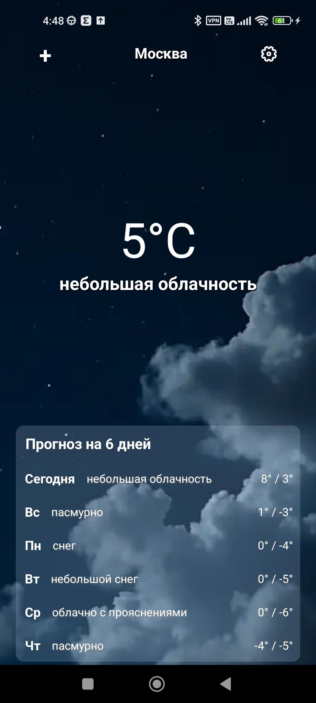
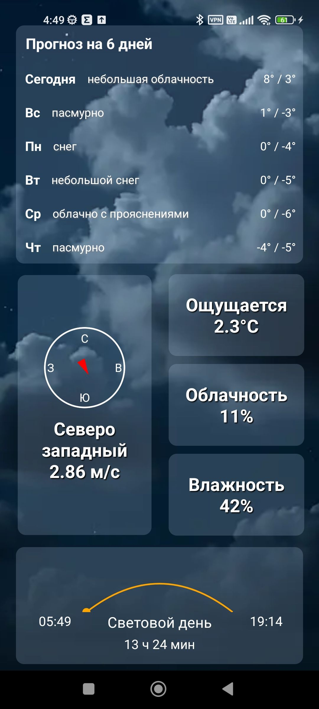

# Open Source Project by Nevionn

Мобильное приложения для отображения погоды

<div align="center" style="display: flex; align-items: center;">
  
  
  
</div>

# Стек технологий

<div align="center" style="display: flex; align-items: center;">
  
  <span style="margin: 0 10px; font-size: 24px;"> </span>
  
</div>

# Установка апк файла 📦

Зайти в раздел [релиз](https://gitlab.com/web4450122/weather-mobile-app/-/releases) и скачать файл weather.apk

# Установка из исходников на android

```bash
git clone https://gitlab.com/web4450122/weather-mobile-app.git

cd weather-mobile-app

npm install

npx react-native start

запуск на андроид: a
```

## ССЫЛКИ

[](https://t.me/ancient_nevionn)
[](https://www.donationalerts.com/r/nevion)
